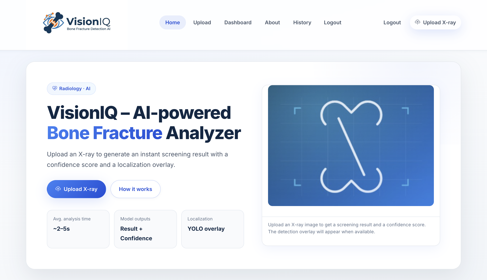
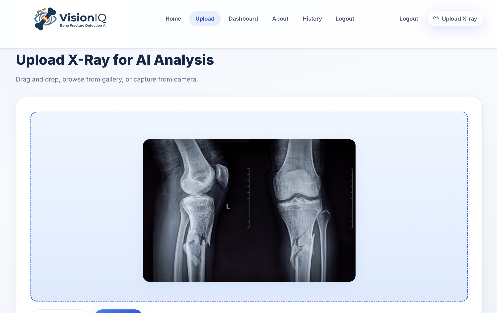
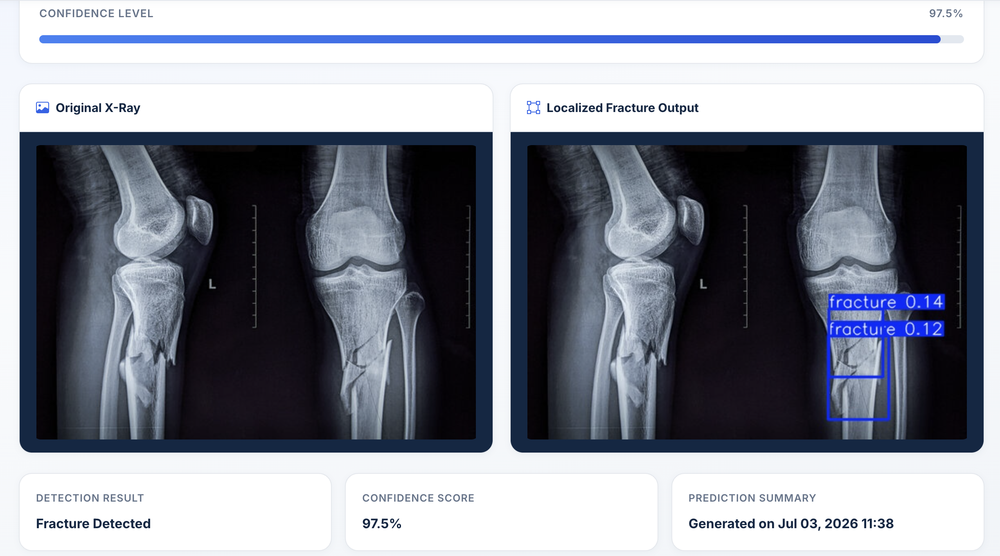
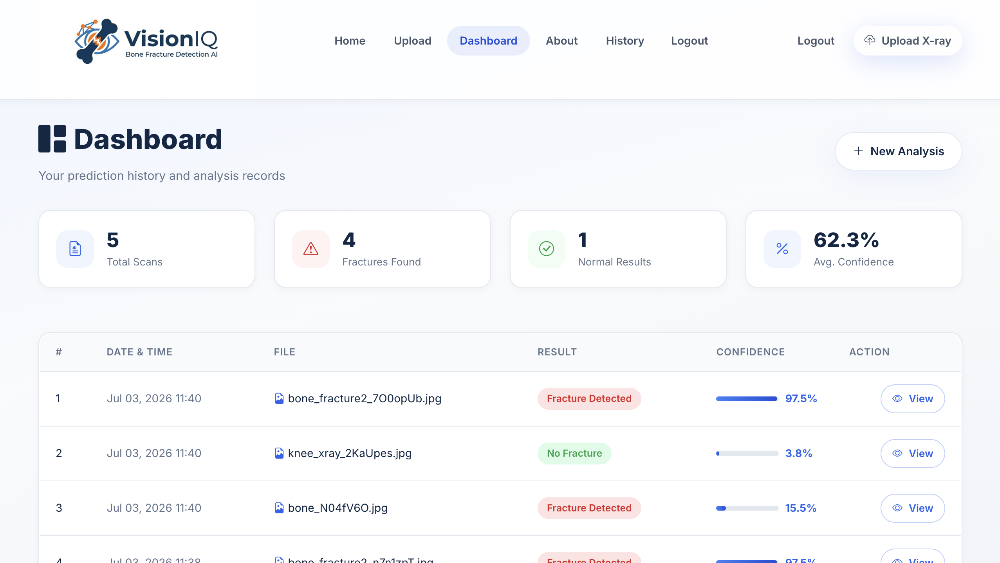
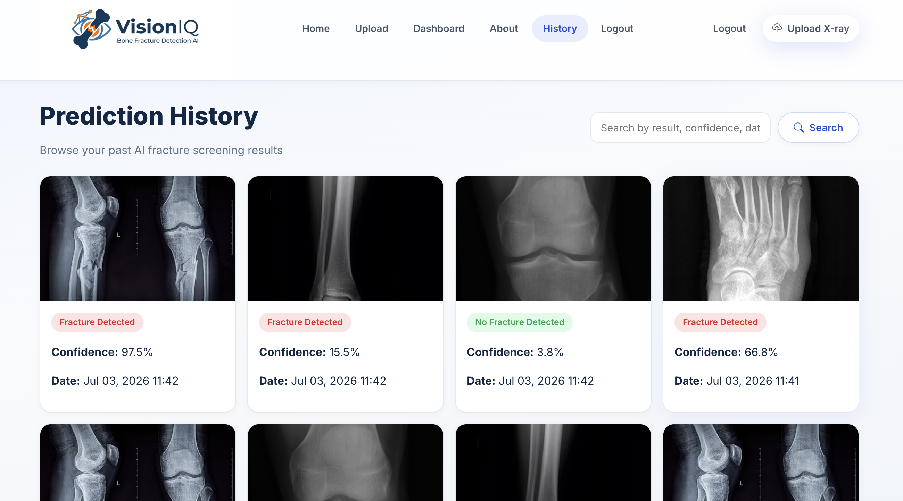

# VisionIQ

## AI-Based Bone Fracture Detection and Localization System

VisionIQ is a deep learning-based medical imaging system designed to automatically detect and localize bone fractures from X-ray images. The system combines image classification and object detection techniques to assist in automated fracture analysis.

## Project Overview

The system uses two deep learning models:

- **ResNet**: Performs fracture classification by identifying whether an X-ray image contains a fracture or is normal.
- **YOLO**: Localizes the fracture region by detecting and highlighting the affected area using bounding boxes.

The models are integrated into a Django-based web application where users can upload X-ray images and receive AI-generated predictions.

## Features

- Upload bone X-ray images for analysis
- Detect whether an X-ray contains a fracture
- Localize fracture regions using bounding boxes
- Web-based interface for easy interaction
- Automated AI-assisted medical image analysis

## System Workflow

```
X-ray Image Upload
        ↓
ResNet Classification Model
        ↓
Fracture / Normal Prediction
        ↓
YOLO Localization Model
        ↓
Fracture Region Detection
        ↓
Result Display
```

## Technologies Used

### Backend
- Python
- Django

### Deep Learning
- ResNet
- YOLO

### Frontend
- HTML
- CSS
- JavaScript

### Database
- SQLite

## Project Structure

```
VisionIQ/
│
├── mainapp/              # Django application
├── templates/            # HTML templates
├── static/               # CSS, JavaScript, static files
├── evaluation/           # Model evaluation scripts
├── requirements.txt      # Python dependencies
├── manage.py             # Django project manager
└── README.md
```

## Installation and Setup

### 1. Clone the repository

```bash
git clone <repository-url>
```

### 2. Navigate to the project directory

```bash
cd VisionIQ
```

### 3. Create a virtual environment

```bash
python -m venv venv
```

### 4. Activate the virtual environment

For Windows:

```bash
venv\Scripts\activate
```

### 5. Install dependencies

```bash
pip install -r requirements.txt
```

### 6. Run the Django server

```bash
python manage.py runserver
```

## Model Weights

The trained model weights are not included in this repository due to their large file size.

## Future Improvements

- Improve model accuracy with larger datasets
- Deploy the application on cloud platforms
- Add support for more bone fracture categories
- Enhance user interface and reporting features

## Authors

Final Year Project - VisionIQ

---


# Screenshots

## 🏠 Home Page



---

## 📤 Upload X-ray



---

## 🩻 Detection Result



---

## Dashboard



---
## History


---

## 📚 Academic Purpose

This project was developed as the **Final Year Major Project** for the **Bachelor of Science in Computer Science and Information Technology (BSc CSIT)** program. It demonstrates the practical application of modern web development, artificial intelligence, and cloud technologies by building a real-world AI-powered image analysis platform.


